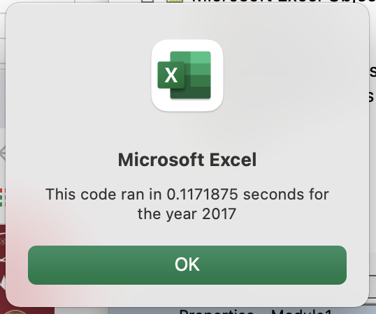
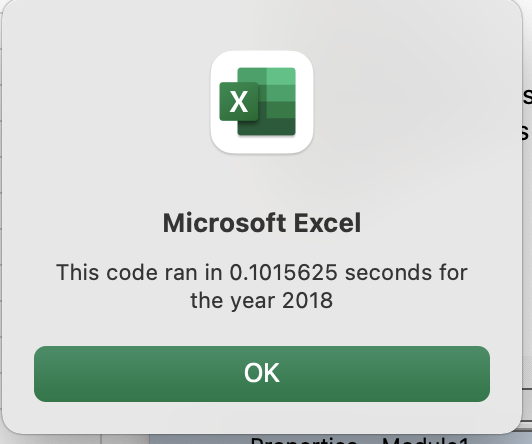

# Stock-analysis

## Overview of Project:
Steve has requested that we take a look at his stock performance from 2017 and 2018 and compare data. In addition, he is looking to not only compare his stock's performance but also look at the entire stock market's perfomance over the same set of years. In order to obtain this data efficiently, we will need to refactor the current VBA code that to be able to execute maybe thousands of data. 
## Results:
### 2017 Dataset
In 2017, the output for the twelve sample tickers shows a general upwards trend in Returns over the year. Only one company in this sample saw a negative return on the year, (TERP -7.2%). While some companies saw over 100% increase in return. When running this data with the original VBA Script, the script ran over .5 seconds, with the refactoring and use of arrays and assigning values to variables, the script for the 2017 data set ran in .117 seconds. 
. 
### 2018 Dataset
In 2018, the twelve companies on average did not perform as well. No company yielded over 100% increase as was the case in 2017 wherein four had hit that benchmark on Returns. There were only two out of the twelve who saw any positive increase in Return the remaining ten were below performance. However as with the 2017 dataset refactor did increase the speed of output. 
. 
## Summary
### Refactoring: Advantages and Disadvantages
#### General
Refactoring is a tool to help code run quicker and more efficiently, there are drawbacks as there needs to be a cost-benefit analysis of how much time will it take to refactor versus how much time will it take to run the code without the additional edits. The data size and code complexity are factors in determining when and where to refactor. 
#### This Dataset
By refactoring the original code, I spent significantly more time re-writing portions and trying to debug the new issues I had created when attempting to essentially create "shortcuts" in the original code. This refactoring lead to a faster output for the 12 tickers, but not sufficient enough to make the time spent on refactoring worthwhile. However, the goal of the exercise is to at some point increase the sample to potentially encompass the entire stock market, in which case a refactored code would be efficient as there would be thousands of tickers that the script would need to cover
